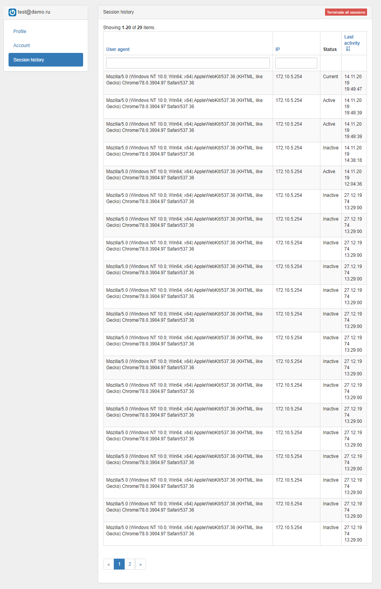
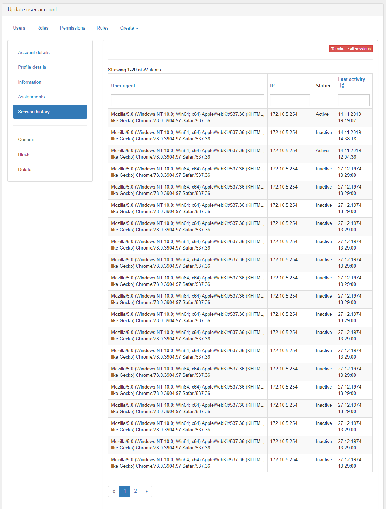

How to enable session history
============================

Session history is list user sessions.

User can delete all session except current.

Configure Module and Application
--------------------------------

```php

// ... 

'modules' => [
    'user' => [
        'class' => Da\User\Module::class,
        'enableSessionHistory' => true,
    ]
], 

// ...

'components' => [
    'session' => Da\User\Service\SessionHistory\SessionHistoryDecorator::class,
]

// ...

'container' => [
    'singletons' => [
        Da\User\Service\SessionHistory\TerminateSessionsServiceInterface::class => Da\User\Service\SessionHistory\TerminateSessionsService::class
    ]
]

// ...

'controllerMap' => [
    'migrate' => [
        ...
        'migrationNamespaces' => [
            'Da\User\Migration\Session',
        ],
    ],
],

```

Additionally for upping migration can use 
```
./yii migrate --migrationNamespaces=Da\\User\\Migration\Session
```

Setting user screenshot:


Admin screenshot:


© [2amigos](http://www.2amigos.us/) 2013-2019
